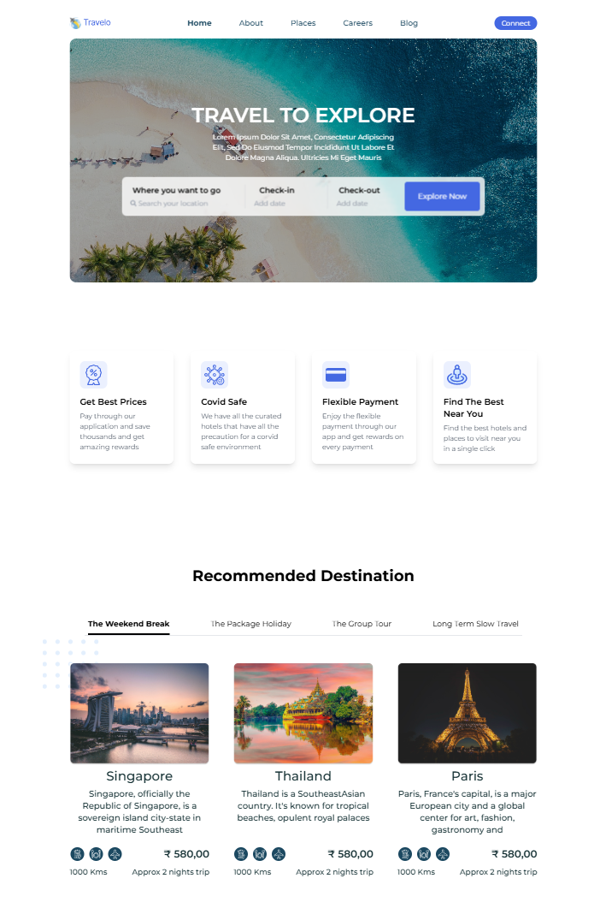

<h1 align="left">🚀• Landing Page</h1>
<!-- <h3 align="left">Hello 👋, I'm Rick !  -->
 I'm exited to present my personal project for the Front End Development course.</h3>

For this project, I created landingpage example of travel  website .</h3>
<!-- <h3 align="center">https://eco-vision.netlify.app/</h3> -->

# Example page

  
  

### Languages

• [tailwindcss](https://tailwindcss.com) 
• [Font Awesome](https://fontawesome.com) 
• [React](https://react.dev) 
